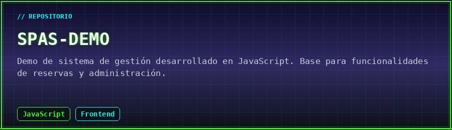
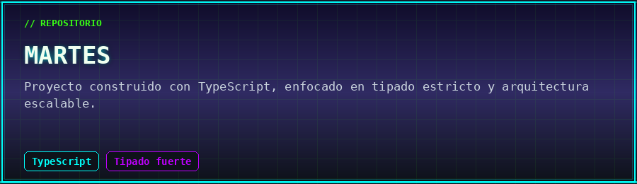
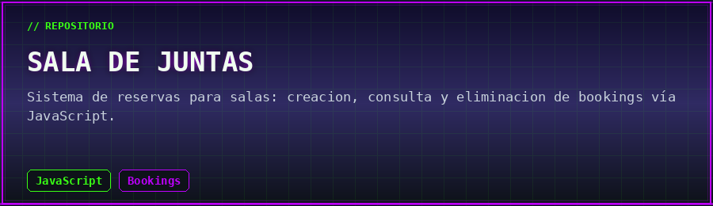
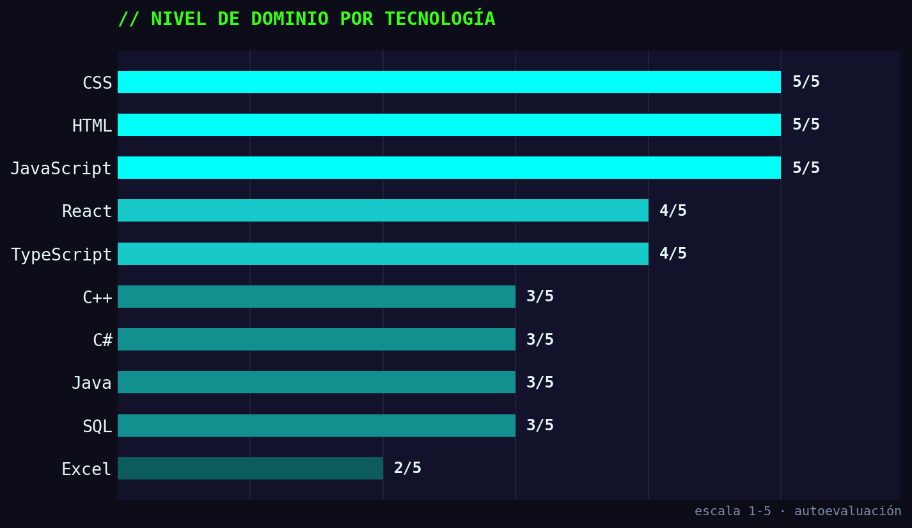

<div align="center">


<br/>

<a href="#">
  
</a>

<br/>


</div>

---

### `// 01. IDENTIDAD`

```yaml
nombre:        Santiago Alfonso Cristiano
rol:           Desarrollador de Software
estudios:      Ingeniería / Desarrollo de Software @ Universidad Uniagustiniana
empresa:       Aurotech (Empresa de Desarrollo)
en_la_empresa: Desde Marzo — en construcción constante
mision:        Convertir café en código, y código en soluciones reales
```

> Estudiante activo de programación y desarrollador en formación, combinando la teoría de la universidad con proyectos reales dentro de **Aurotech**. Cada línea de código es un paso más hacia sistemas más limpios, más rápidos y mejor pensados.

---

### `// 02. STACK TECNOLÓGICO`

<div align="center">


<br/><br/>


</div>

<div align="center">

#### `// asistentes de IA en el flujo de trabajo`


</div>

| Categoría | Herramientas |
|---|---|
| **Frontend** | `HTML` · `CSS` · `JavaScript` · `TypeScript` · `React` |
| **Backend / Lenguajes** | `Java` · `C#` · `C++` |
| **Datos** | `SQL` · `Excel` (manejo básico) |
| **IA / Productividad** | `GitHub Copilot` · `Claude` (uso básico de agentes) |

---

### `// 03. LOG DE PROYECTOS`

<table width="100%">
<tr>
<td width="33%" valign="top">

**🚴 Tour de Francia — DB**

Base de datos para consulta de corredores, equipos y marcas de colaboración del Tour de Francia. Estructuración y consulta de datos deportivos.

`SQL` `Bases de Datos`

</td>
<td width="33%" valign="top">

**⚽ FC Barcelona Web Clone**

Réplica fiel de la página oficial del equipo, desarrollada con TypeScript cuidando cada detalle visual y estructural frente al sitio original.

`TypeScript` `Frontend`

</td>
<td width="33%" valign="top">

**✈️ Selección de Sillas — Aerolínea**

Sistema para asignar/elegir sillas estilo "selección de butacas de cine", aplicado al contexto de una aerolínea.

`C++` `Lógica de asignación`

</td>
</tr>
</table>

<div align="center">

📌 *Proyectos académicos de la Uniagustiniana en desarrollo — próximamente documentados y subidos.*

</div>

---

### `// 04. REPOSITORIOS DESTACADOS`

<div align="center">

<a href="https://github.com/santicris232-netizen/Spas-DEMO">
  
</a>

<br/><br/>

<a href="https://github.com/santicris232-netizen/martes">
  
</a>

<br/><br/>

<a href="https://github.com/santicris232-netizen/Sala-de-juntas-">
  
</a>

</div>

---

### `// 05. NIVEL DE DOMINIO`

<div align="center">



</div>

<div align="center">

📊 *Autoevaluación de práctica actual — se actualiza a medida que avanzo en la universidad y en Aurotech.*

</div>

---

### `// 06. CANAL DE CONTACTO`

<div align="center">

[](mailto:santicris232@gmail.com)
[](https://github.com/santicris232-netizen)

</div>

<div align="center">


**`> conexión estable — sesión abierta para nuevos proyectos_`**

</div>
